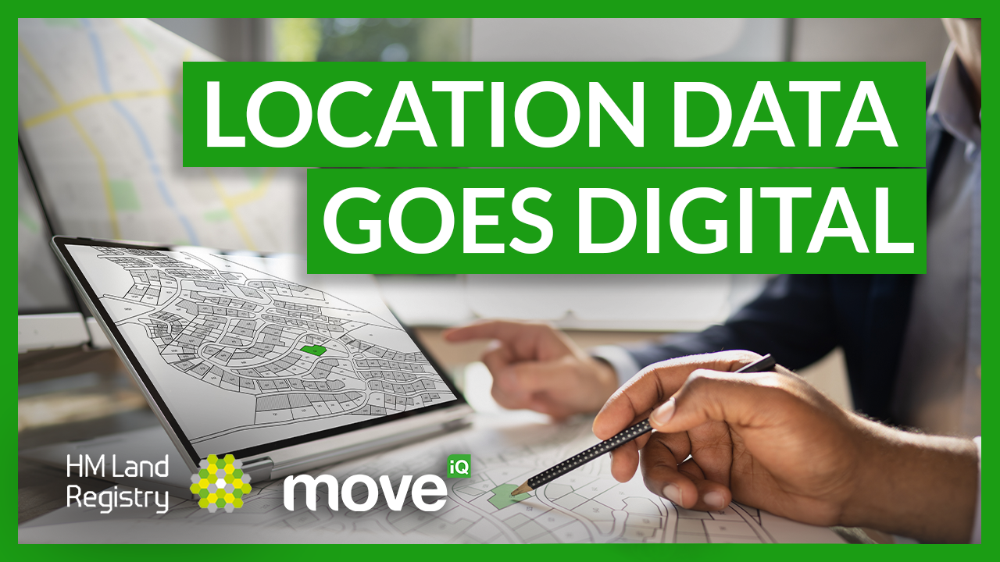

{: .heading-large}
<h2>Latest video</h2>

<a href='https://www.youtube.com/watch?v=lu7e7DJ5xNY'>Location Data's Going Digital | Move iQ People in Property Series</a> - December 2022 (32 mins)

Programme Director Mark Kelso is in a panel interview with Channel 4’s property expert Phil Spencer to explain how the digital LLC Register is improving the property market in England and Wales. Also in the panel: Catherine Young, Head of Analysis and Data Strategy, Geospatial Commission, Andrew Trigg, Chief Geospatial and Data Officer, HM Land Registry and Carly Morris, Head of Geovation, Ordnance Survey.

{: .heading-large}
<h2>Newsletters</h2>

Read our monthly programme newsletters. If you would like to subscribe to our newsletters, please join our <a href="https://public.govdelivery.com/accounts/UKGOVUK_LR/signup/35766">mailing list</a>.

    
{: .heading-small}
2024
    
 <ol class='list list-number'>
    <li><a href='files/Communications/July%20newsletter%202024.pdf' onclick='linkClicked()'>July</a></li> 
    <li><a href='files/Communications/LLC%20newsletter_May2024.pdf' onclick='linkClicked()'>May</a></li>
    <li><a href='files/Communications/April%20newsletter%202024.pdf' onclick='linkClicked()'>April</a></li>
    <li><a href='files/Communications/March%20newsletter%202024.pdf' onclick='linkClicked()'>March</a></li> 
    <li><a href='files/Communications/LLC%20newsletter_Feb2024.pdf' onclick='linkClicked()'>February</a></li>
    <li><a href='files/Communications/LLC%20newsletter_Jan2024.pdf' onclick='linkClicked()'>January</a></li>
    
</ol>

{: .heading-large}
<h2>Case Studies</h2>

<ol class='list list-number'>
<li><a href='files/Communications/LLC_CASE%20STUDY_Tameside_291021.pdf' onclick='linkClicked()'>Tameside Council </a></li>
<li><a href='files/Communications/OXBRIDGE%20CASE%20STUDY_%20east%20west%20rail%203_BEST%20(1).pdf' onclick='linkClicked()'>The OxCam Arc</a></li>
<li><a href='files/Communications/CASE%20STUDY_LIVERPOOLCOUNCIL_vc.pdf' onclick='linkClicked()'>Liverpool Council </a></li>
<li><a href='files/Communications/CASE%20STUDY_HS2_vb.pdf' onclick='linkClicked()'>HS2 </a></li>

</ol>

{: .heading-large}
<h2>Blog</h2>

<ol class='list list-number'>
     <li><a href='files/Communications/How%20technology%20is%20supporting%20HM%20Land%20Registry.pdf' onclick='linkClicked()'>How technology is supporting HM Land Registry</a> - Mark Edwards, Service Manager</li>
</ol>

{: .heading-large}
<h2>Webinars</h2>

Register to watch our webinar recordings.

<ol class='list list-number'>
   <li><a href='https://register.gotowebinar.com/recording/1662619232768603400' onclick='linkClicked()'>Local Authority Service Assessments </a> - March 2022 (57 mins)</li>
    <li><a href='https://register.gotowebinar.com/recording/viewRecording/2299268349383944717/2396537746131633675/lissa.naylor@landregistry.gov.uk?registrantKey=3803514606460205837&type=ATTENDEEEMAILRECORDINGLINK' onclick='linkClicked()'>What is happening with Local Land Charges </a> - Feb 2022 (1 hr 25 mins)</li>
    <li><a href='https://register.gotowebinar.com/recording/viewRecording/1397859030119229709/6121466537091236619/lissa.naylor@landregistry.gov.uk?registrantKey=3229654198996896013&type=ATTENDEEEMAILRECORDINGLINK' onclick='linkClicked()'>What is happening with LLC </a> - Jan 2022 (1 hr 23 mins)</li>
    <li><a href='https://register.gotowebinar.com/recording/1949531289368842511' onclick='linkClicked()'>Partnering with Idox</a> - July 2021 (1 hr 35 mins)</li>
    <li><a href='https://register.gotowebinar.com/recording/3530810429418704141' onclick='linkClicked()'>Partnering with Agile</a> - July 2021 (1 hr 20 mins)</li>
    <li><a href='https://register.gotowebinar.com/recording/6437359521685068801' onclick='linkClicked()'>Partnering with DEF Software</a> - July 2021 (1 hr)</li>
    <li><a href='https://register.gotowebinar.com/recording/7224921008786406415' onclick='linkClicked()'>Partnering with Northgate</a> - June 2021 (1 hr 40 mins)</li>
    <li><a href='https://register.gotowebinar.com/recording/8203069637203220491' onclick='linkClicked()'>Supporting economic benefits</a> - October 2020 (1 hr 30 mins)</li>
    <li><a href='https://register.gotowebinar.com/recording/1242249536228957967' onclick='linkClicked()'>Technical data webinar</a> - July 2020 (51 mins)</li>
    <li><a href='https://register.gotowebinar.com/recording/2901021156248164104' onclick='linkClicked()'>Data analysis webinar</a> - July 2020 (1 hr 9 mins)</li>
    <li><a href='https://register.gotowebinar.com/register/3466118454595895566' onclick='linkClicked()'>Pre-migration webinar</a> - June 2020 (2 hrs 46 mins)</li>
    <li><a href='files/Communications/Local%20authority%20migration%20experiences%20webinar%20%E2%80%93%20September%202020.pdf' onclick='linkClicked()'>Local authority migration experiences</a> - webinar slides (recording unavailable) September 2020 (PDF 1.6MB)</li>
    
     
    
    
    </ol>
   
   {: .heading-large}
<h2>Archived newsletters</h2>

  
  {: .heading-small}
2023
    
 <ol class='list list-number'>
    <li><a href='files/Communications/LLC%20newsletter_Dec2023.pdf' onclick='linkClicked()'>December </a></li>
    <li><a href='files/Communications/LLC%20newsletter_Nov2023.pdf' onclick='linkClicked()'>November </a></li>
    <li><a href='files/Communications/LLC%20newsletter_Oct2023.pdf' onclick='linkClicked()'>October </a></li>
    <li><a href='files/Communications/LLC%20newsletter_Sept2023.pdf' onclick='linkClicked()'>September </a></li>
    <li><a href='files/Communications/LLC%20newsletter_August%202023(004).pdf' onclick='linkClicked()'>August </a></li> 
    <li><a href='files/Communications/LLC%20newsletter_July%202023.pdf' onclick='linkClicked()'>July </a></li>
    <li><a href='files/Communications/LLC%20newsletter_June%202023.pdf' onclick='linkClicked()'>June </a></li>
    <li><a href='files/Communications/LLC%20newsletter_NEW%20STYLE_May%202023%20(002).pdf' onclick='linkClicked()'>May </a></li>
    <li><a href='files/Communications/LLC%20newsletter_NEW%20STYLE_April%202023.pdf' onclick='linkClicked()'>April </a></li>
    <li><a href='files/Communications/LLC%20newsletter_NEW%20STYLE_MARCH%202023%20EDITION.pdf' onclick='linkClicked()'>March </a></li>
    <li><a href='files/Communications/LLC%20newsletter_NEW%20STYLE_FEB%202023%20EDITION_GG%20(002).pdf' onclick='linkClicked()'>February </a></li>
    <li><a href='files/Communications/LLC%20newsletter_NEW%20STYLE_JANUARY%202023_GG%20(002).pdf' onclick='linkClicked()'>January </a></li>
    
     
{: .heading-small}
2022

<ol class='list list-number'>
 <li><a href='files/Communications/LLC%20newsletter_NEW%20STYLE_DECEMBER%202022%201.pdf' onclick='linkClicked()'>December </a></li>
 <li><a href='files/Communications/LLC%20newsletter_NOVEMBER%202022.pdf' onclick='linkClicked()'>November </a></li>
 <li><a href='files/Communications/LLC%20newsletter%20OCTOBER%202022%20(1).pdf' onclick='linkClicked()'>October </a></li>
 <li><a href='files/Communications/LLC%20newsletter_NEW%20STYLE_SEP%202022.pdf' onclick='linkClicked()'>September </a></li>
 <li><a href='files/Communications/LLC%20newsletter_NEW%20STYLE_AUG%202022.pdf' onclick='linkClicked()'>August </a></li>
 <li><a href='files/Communications/LLC%20newsletter_NEW%20STYLE_JULY%202022.pdf' onclick='linkClicked()'>July </a></li>
 <li><a href='files/Communications/LLC%20newsletter_JUNE%2017%202022.pdf' onclick='linkClicked()'>June </a></li>
 <li><a href='files/Communications/LLC%20newsletter_NEW%20STYLE_MAY%202022.pdf' onclick='linkClicked()'>May </a></li>
 <li><a href='files/Communications/LLC%20newsletter_APRIL%202022.pdf' onclick='linkClicked()'>April </a></li>
 <li><a href='files/Communications/LLC%20newsletter_MARCH%202022.pdf' onclick='linkClicked()'>March </a></li>
 <li><a href='files/Communications/HM%20Land%20Registry%20local%20land%20charges%20newsletter%20January%202022.pdf' onclick='linkClicked()'>January </a></li>   
  </ol>

  
{: .heading-small}
2021

<ol class='list list-number'>
 <li><a href='files/Communications/DECEMBER%20newsletter%202021.pdf' onclick='linkClicked()'>December </a></li>
 <li><a href='files/Communications/NOVEMBER%20newsletter%202021.pdf' onclick='linkClicked()'>November </a></li>   
 <li><a href='files/Communications/OCTnewsletter%202021.pdf' onclick='linkClicked()'>October </a></li>
  <li><a href='files/Communications/August%20Newsletter.pdf' onclick='linkClicked()'>August </a></li>
  <li><a href='files/Communications/JULY%20newsletter%202021.pdf' onclick='linkClicked()'>July </a></li>
  <li><a href='files/Communications/JUNE%20newsletter%202021.pdf' onclick='linkClicked()'>June </a></li>
  <li><a href='files/Communications/HM%20Land%20Registry%20local%20land%20charges%20newsletter%20May%202021.pdf' onclick='linkClicked()'>May </a></li>
  <li><a href='files/Communications/April-21-Newsletter.pdf' onclick='linkClicked()'>April </a></li>
  <li><a href='files/Communications/FEB%20newsletter%202021.pdf' onclick='linkClicked("February 2021")'>February </a></li>
  <li><a href='files/Communications/HM%20Land%20Registry%20local%20land%20charges%20newsletter%20January%202021.pdf' onclick='linkClicked()'>January </a></li>
  </ol>  
    
    
{: .heading-small}
2020
 <ol class='list list-number' start='8'>
    <li><a href='files/Communications/NOV-DEC%20newsletter%202020.pdf' onclick='linkClicked()'>November/December </a></li>
    <li><a href='files/Communications/October%20LLC%20Final.pdf' onclick='linkClicked()'>October </a></li>
    <li><a href='files/Communications/email%20newsletter%20SEPT%202020.pdf' onclick='linkClicked()'>September </a></li>
    <li><a href='files/Communications/email%20newsletter%20AUG%202020.pdf' onclick='linkClicked()'>August </a></li>
    <li><a href='files/Communications/July%20Khub%20newsletter%20FINAL.pdf' onclick='linkClicked()'>July </a></li>
    <li><a href='files/Communications/KHub%20Newsletter%20-%20%20June%202020%20.pdf' onclick='linkClicked()'>June </a></li>
    <li><a href='files/Communications/May%20newsletter%20-%20FINAL.pdf' onclick='linkClicked()'>May </a></li>
    <li><a href='files/Communications/Khub%20Newsletter%20-%20MarchApril.pdf' onclick='linkClicked()'>April </a></li>
</ol>
